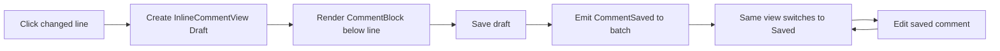

# Embedded Code Review Comments Technical Spec

## Context
This spec implements the behavior described in [`PRODUCT.md`](PRODUCT.md) for embedded line-level code review comments in the Warp code editor.

The current branch is based on commit `da65ad17ed074db384f78efd092c5d7e74c79705`. The most relevant code paths are:

- [`app/src/code/editor/view.rs @ da65ad17`](https://github.com/warpdotdev/warp/blob/da65ad17ed074db384f78efd092c5d7e74c79705/app/src/code/editor/view.rs) — owns `CodeEditorView`, comment location reconciliation, inline comment view lifecycle, and the legacy floating composer path.
- [`app/src/code/editor/inline_comment_view.rs @ da65ad17`](https://github.com/warpdotdev/warp/blob/da65ad17ed074db384f78efd092c5d7e74c79705/app/src/code/editor/inline_comment_view.rs) — new stable per-comment inline view that owns the body editor and switches between draft, saved, and editing modes.
- [`app/src/code/editor/comment_editor.rs @ da65ad17`](https://github.com/warpdotdev/warp/blob/da65ad17ed074db384f78efd092c5d7e74c79705/app/src/code/editor/comment_editor.rs) — legacy composer plus shared inline comment shell helpers used by both legacy composer and embedded inline cards.
- [`app/src/code/editor/embedded_comment.rs @ da65ad17`](https://github.com/warpdotdev/warp/blob/da65ad17ed074db384f78efd092c5d7e74c79705/app/src/code/editor/embedded_comment.rs) — app-side `LaidOutEmbeddedItem` and `RenderableBlock` implementations that host inline comment views inside `warp_editor` render blocks.
- [`app/src/code/editor/element.rs @ da65ad17`](https://github.com/warpdotdev/warp/blob/da65ad17ed074db384f78efd092c5d7e74c79705/app/src/code/editor/element.rs) — code editor wrapper and gutter rendering; draws diff backgrounds, line numbers, gutter buttons, removed-line overlays, and embedded-comment spacer rows.
- [`app/src/code/editor/line.rs @ da65ad17`](https://github.com/warpdotdev/warp/blob/da65ad17ed074db384f78efd092c5d7e74c79705/app/src/code/editor/line.rs) — maps editor line locations to render-line locations, including the inline-comment-specific below-line anchor mapping.
- [`crates/editor/src/render/model/mod.rs @ da65ad17`](https://github.com/warpdotdev/warp/blob/da65ad17ed074db384f78efd092c5d7e74c79705/crates/editor/src/render/model/mod.rs) — render model support for per-view `CommentBlock`s and `BlockItem::EmbeddedComment`.
- [`crates/editor/src/render/element/mod.rs @ da65ad17`](https://github.com/warpdotdev/warp/blob/da65ad17ed074db384f78efd092c5d7e74c79705/crates/editor/src/render/element/mod.rs) — converts `BlockItem::EmbeddedComment` into app-provided renderable blocks.

The pre-existing model used a single `active_comment_editor` for the comment composer and separate read-only views for saved inline cards. That created visible transitions and stale state because saving replaced one hosted view with another. The embedded path now treats each inline comment as a stable per-comment view identified by `CommentId` from draft creation through saved/editing states. The legacy floating composer remains for the feature-flag-off path.

## Proposed changes
1. Gate the embedded inline behavior behind `FeatureFlag::EmbeddedCodeReviewComments`.
   - When disabled, preserve the existing `PendingComment` and `active_comment_editor` floating overlay path.
   - When enabled, derive inline blocks from stable `InlineCommentView` instances and avoid relying on `EditorCommentsModel::pending_comment` for embedded rendering.

2. Represent every inline comment, including unsaved drafts, with a concrete `CommentId`.
   - `CommentId::new()` is assigned when a draft inline view is created.
   - The same id is used when the draft is saved into an `EditorReviewComment`.
   - Canceling a new draft drops the view and never persists the id.

3. Use `InlineCommentView` as the stable embedded comment surface.
   - Add internal modes for saved, new draft, and editing existing comments.
   - The view owns one `RichTextEditorView` for its lifetime.
   - Mode changes update interaction state, footer actions, labels, and saved content without replacing the view subtree.
   - Draft/editing mode uses `InteractionState::Editable`; saved mode uses `InteractionState::Selectable`.

4. Keep one inline view collection in `CodeEditorView`.
   - Use `inline_comments: HashMap<CommentId, ViewHandle<InlineCommentView>>` for both saved comments and unsaved drafts.
   - Reconcile saved comments from the review batch by id.
   - Preserve draft views while reconciling the saved batch.
   - Drop removed saved views that are no longer present and are not drafts.

5. Keep `CommentEditor` only as the legacy composer.
   - `CommentEditor` remains responsible for the pre-existing feature-flag-off behavior where a single composer is positioned as a floating overlay below the selected line. That path still depends on `EditorCommentsModel::pending_comment`, `PendingCommentEvent`, and `active_comment_editor`, so removing it would broaden the change beyond the embedded feature.
   - When `EmbeddedCodeReviewComments` is enabled, `CommentEditor` is not the source of truth for inline drafts or saved-card edits. Embedded comments are represented by stable `InlineCommentView` instances that own their own body editor and mode.
   - Keep `CommentEditor` and `InlineCommentView` visually consistent by sharing shell helpers from `comment_editor.rs`: max width, background, border, corner radius, body padding, footer padding, footer border, and chrome-height constants.
   - This split lets the embedded implementation eliminate the view swap that caused flicker, while preserving the legacy overlay as a low-risk fallback and avoiding a simultaneous migration of the flag-off code path.

6. Add render-model support for per-view inline comment blocks.
   - Add `CommentBlock` and `BlockItem::EmbeddedComment` in `crates/editor` so comment spacing lives on the per-view render state and does not mutate the shared buffer.
   - `CodeEditorModel::set_inline_comment_blocks` replaces the full per-view set each time `CodeEditorView` reconciles inline views.
   - `Current` anchors use `into_inline_comment_render_line_location` so comments appear below the referenced current line.
   - `Removed` anchors map to `RenderLineLocation::Temporary` so removed-line comments attach to the exact removed-line slot.

7. Host app views inside embedded comment render blocks.
   - `LaidOutInlineSavedComment` resolves `InlineCommentView` by window and entity id.
   - `RenderableSavedComment` lays out, paints, after-layouts, and dispatches events to the hosted `ChildView`.
   - The same bridge is retained for `CommentEditor` in the legacy embedded/fallback code.

8. Pin inline comment horizontal painting to the visible editor viewport.
   - `viewport_pinned_origin` uses the block's vertical content position and the render context's visible x origin.
   - Inline comments reserve vertical space in the content tree but do not scroll horizontally with long code lines.
   - The implementation keeps vertical anchoring while preventing horizontal clipping.

9. Update gutter and background behavior.
   - Suppress saved-comment gutter icons when embedded comments are enabled and an inline card/draft/editor exists for that line.
   - Render embedded comment gutter rows without duplicate line numbers or action buttons.
   - Extend added-line decorations through inline comment blocks.
   - Extend removed-line overlay groups through embedded comment rows, including replacement hunks.
   - Classify embedded comment rows anchored to `Temporary` render locations as removed-side rows for gutter sliver and background behavior.

10. Preserve imported comment metadata.
   - Carry `CommentOrigin` from `AttachedReviewComment` to `EditorReviewComment`.
   - Inline saved/editing views display GitHub-import metadata where applicable.

11. Preserve bottom-panel and persistence behavior.
   - Saving still emits `CodeEditorEvent::CommentSaved` with an `EditorReviewComment` for the owning code review view to upsert into the batch.
   - Removing still emits `CodeEditorEvent::DeleteComment { id }`.
   - Inline views are a per-editor presentation of the batch, not a second persistence source.

## End-to-end flow
1. User clicks a changed line's add-comment affordance with embedded comments enabled.
2. `CodeEditorViewAction::NewCommentOnLine` creates `InlineCommentView::new_draft`, stores it in `inline_comments` by its new `CommentId`, wires subscriptions, and syncs inline comment blocks.
3. `RenderState` receives a `CommentBlock` below the target line.
4. `RenderableSavedComment` hosts the draft inline view, and the body editor is focused.
5. User enters body text and saves.
6. `InlineCommentView` emits `CommentSaved { id, line, comment_text }`.
7. `CodeEditorView` creates an `EditorReviewComment` with that id, emits `CodeEditorEvent::CommentSaved`, and calls `complete_save` on the same inline view.
8. The owning code review model persists/upserts the saved comment. Later batch reconciliation reuses the same inline view by id.
9. User clicks Edit on a saved card.
10. The same inline view switches to editing mode. Saving updates the batch and switches the same view back to saved mode. Canceling restores saved content.

## Testing and validation
- Behavior 1–3: unit/layout coverage for inline composer opening below the target line with `test_inline_composer_pushes_lines_down_when_flag_on`.
- Behavior 4: unit and manual coverage for added and removed diff backgrounds extending through inline blocks. Removed/replacement handling is guarded by render-model and editor tests for removed-line anchors.
- Behavior 5: manual verification by horizontally scrolling long diff lines while an inline draft or saved card is visible. The card should remain visible at the viewport's left edge.
- Behavior 6–15: focused tests for saved card rendering and edit/save transitions, including `test_saved_comment_renders_inline_and_pushes_lines_down` and `test_editing_saved_comment_updates_block_in_place`.
- Behavior 16: deletion path should be verified by adding a test that clicks/removes through `InlineCommentViewEvent::RequestRemove` or by extending existing comment batch tests.
- Behavior 17–20: render model tests in `crates/editor/src/render/model/mod_tests.rs` cover stacking, current-line anchors, temporary removed-line anchors, and mixed current/temporary anchors.
- Behavior 21: `test_inline_composer_not_inline_when_flag_off` verifies the flag-off path does not create inline blocks.
- Behavior 22–25: `comment_gutter_icons_are_hidden_only_for_embedded_comment_lines` and editor element behavior cover gutter icon suppression and comment spacer rows.
- Behavior 26–28: integration helpers and tests in `app/src/code_review/code_review_view_integration.rs`, `app/src/integration_testing/code_review/mod.rs`, and `crates/integration/src/test/code_review.rs` cover inline card presence, no diff snippet, outdated filtering, and diff mode relocation.
- Behavior 29: composer helper tests cover focus, escape, cancel, save button disabled state, and update labels. Additional tests should be added for stable inline view focus if the feature continues to evolve.
- Before opening a PR, run `./script/format`, `cargo clippy --workspace --all-targets --all-features --tests -- -D warnings`, and the focused tests above.
- Manual verification should include:
  - Add comment on added line.
  - Add comment on removed line in a replacement hunk.
  - Save, edit, cancel, update, and remove.
  - Horizontally scroll while draft and saved cards are visible.
  - Toggle `embedded_code_review_comments` off and confirm legacy overlay still works.

## Risks and mitigations
- Risk: The embedded path no longer uses `pending_comment`, while the legacy overlay still does. Mitigation: explicitly gate render and action paths on `FeatureFlag::EmbeddedCodeReviewComments` and keep legacy code path intact.
- Risk: Draft comments now get a `CommentId` before persistence. Mitigation: `CommentId` is already a local UUID wrapper and can safely identify drafts that are later discarded.
- Risk: Inline comment blocks are per-view render state. Multiple views over the same buffer could accidentally share spacing if blocks leak into shared content. Mitigation: `CodeEditorModel::set_inline_comment_blocks` updates the per-view `RenderState` only, and model tests verify isolation.
- Risk: Horizontal viewport pinning may make the card feel visually detached from highly indented code. Mitigation: the card remains vertically anchored below the target line and the hunk background spans through it, matching GitHub-like diff row behavior.
- Risk: Large comments may create tall inline blocks. Mitigation: editable drafts cap at `MAX_COMMENT_HEIGHT` and scroll internally; saved cards reserve full height so the full saved body remains visible in the diff.

## Parallelization
No sub-agent parallelization is recommended for this change at this point. The implementation spans tightly coupled UI state, render-model anchoring, and tests; splitting those across agents would likely increase merge conflict and coordination overhead more than it would reduce wall-clock time. If future work adds broader integration coverage or visual regression screenshots, that validation work could be delegated separately after the core implementation stabilizes.

## Follow-ups
- Add explicit tests for removing a saved inline card directly through the saved card footer.
- Consider migrating the flag-off floating overlay path to the shared `InlineCommentView` shell if the legacy path remains in use for a long time.
- Consider adding a visual regression or integration-video test for the horizontal scrolling behavior and replacement-hunk removed-line backgrounds.
